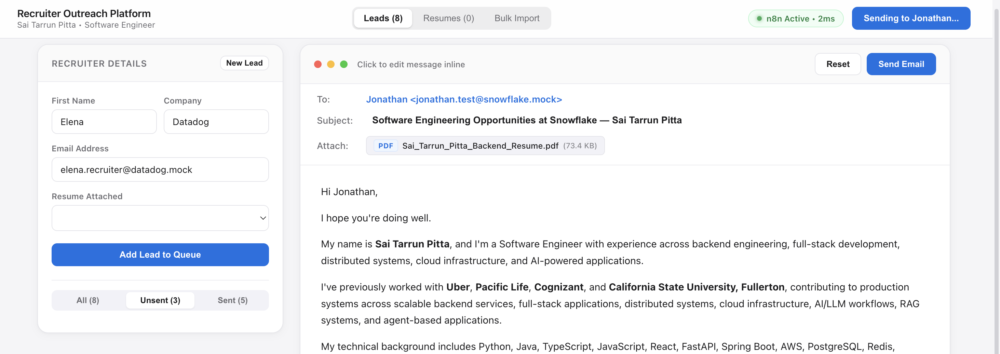
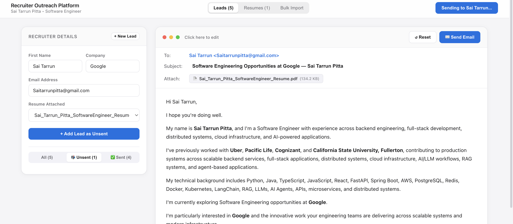
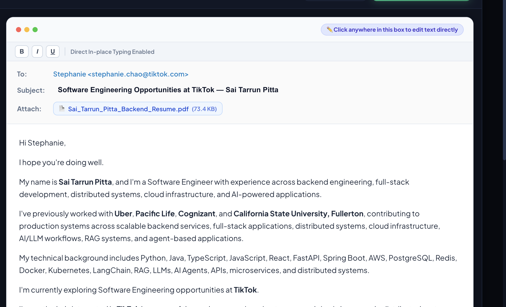

<div align="center">

# Recruiter Outreach Platform & Automation Engine

An autonomous, full-stack recruitment outreach and cold email automation platform powered by **n8n**, an **Apple HIG UI Studio**, and a **Persistent Local SQLite Database**.

[](#)
[](#)
[](LICENSE)

<br/>



</div>

---

## ⚡ 1-Command Turnkey Installation (macOS, Windows, Linux)

You can run the entire platform (n8n Engine + UI Studio + SQLite Storage + Native Desktop App) locally in under 60 seconds with **zero configuration**:

### 1. Clone the Repository
```bash
git clone https://github.com/saitarrun/n8n-recruiter-outreach-automation.git
cd n8n-recruiter-outreach-automation
```

### 2. Launch on Your Operating System

* **🍎 macOS**:
  ```bash
  ./start.sh
  ```
  *(Or double-click `start.command` — automatically creates the native **Recruiter Outreach** app on your Desktop with high-res icon!)*

* **🪟 Windows**:
  Double-click **`start.bat`** *(automatically creates a **Recruiter Outreach** shortcut on your Windows Desktop with the `.ico` icon!)*

* **🐳 Docker Compose** (Any OS):
  ```bash
  docker compose up -d
  ```

### 3. Open the Apps
* **🖥️ Outreach UI Studio**: [http://localhost:3000](http://localhost:3000)
* **⚙️ n8n Automation Engine**: [http://localhost:5678](http://localhost:5678)

---

## 📸 Visual Usage Workflow

### 1. Interactive WYSIWYG Outreach Studio
Compose and customize cold outreach in real time. Modifying the recruiter's **First Name**, **Company**, or **Email** dynamically updates the salutation, subject line, custom focus paragraphs, and header metadata instantly.


---

### 2. Bulk Lead Ingestion (Excel & Word Documents)
Drag and drop any `.xlsx`, `.xls`, `.csv`, or `.docx` document onto the **Bulk Import** tab. The platform automatically detects column headers (`Name`, `Company`, `Email`, `Focus/Role`), renders an in-browser staged preview, and imports all leads into the persistent SQLite database.



---

### 3. n8n Autonomous Workflow Engine
The backend workflow handles binary resume attachment resolution, dynamic email payload construction, and Gmail API dispatch with exponential backoff and rate limiting.



---

## 🔑 One-Time Gmail OAuth Setup (2 Minutes)

To send emails through your personal Gmail account:

### Step 1: Create OAuth Credentials in Google Cloud Console
1. Go to the [Google Cloud Console](https://console.cloud.google.com/).
2. Create a new project (e.g. `Recruiter Outreach`).
3. Enable the **Gmail API**.
4. Go to **APIs & Services** $\rightarrow$ **OAuth consent screen**:
   * Set User Type to **External** $\rightarrow$ Add your email address under Test Users.
5. Go to **Credentials** $\rightarrow$ **Create Credentials** $\rightarrow$ **OAuth client ID**:
   * Application type: **Web application**
   * Name: `n8n Gmail Integration`
   * Authorized Redirect URI: `http://localhost:5678/rest/oauth2-credential/callback`
6. Copy your **Client ID** and **Client Secret**.

### Step 2: Connect in n8n
1. Open **[http://localhost:5678](http://localhost:5678)**.
2. Navigate to **Credentials** $\rightarrow$ **Add Credential** $\rightarrow$ Search for **Gmail OAuth2**.
3. Paste your **Client ID** and **Client Secret**, click **Connect my account**, and approve permissions.
4. Save the credential as `Gmail OAuth2 account`.

---

## 🚀 Core Features

* **🗄️ Persistent Local SQLite Database (`leads.db`)**: Every lead, imported document, and dispatched email is permanently tracked and archived on disk across reboots.
* **🛡️ Sent Lead Duplicate Protection**: Active unsent leads and sent history are strictly segregated. Automated bulk dispatch runs **only** target unsent leads, ensuring you never double-email a recruiter.
* **📄 Multi-Resume PDF Library & Quick Look**: Upload and manage multiple resume variants (e.g., *Backend*, *Full-Stack*, *General*) and preview them in-app using Apple Quick Look.
* **⚡ Live Engine Heartbeat**: Real-time status indicator showing n8n connectivity and sub-millisecond execution latency.
* **⏱️ Anti-Spam Rate Spacing**: Automatic 4-second delivery pauses between consecutive emails during bulk runs to protect your Gmail domain reputation.

---

## 📁 Repository Structure

```
n8n-recruiter-outreach-automation/
├── ui/
│   ├── index.html         # Apple HIG Outreach Studio UI
│   ├── server.py          # Local server, SQLite database, & relay proxy
│   └── leads.db           # Persistent SQLite database
├── workflows/
│   ├── direct_recruiter_outreach_batch_workflow.json  # Webhook email sender
│   ├── recruiter_outreach_orchestrator.json           # Automated daily runner
│   └── recruiter_reply_followup_tracker.json         # Follow-up tracker
├── assets/                # Visual demo screenshots and banners
├── files/                 # Persistent resume PDF storage directory
├── sample_recruiter_leads.csv    # Sample test CSV file
├── sample_recruiter_leads.docx   # Sample test Word document
├── docker-compose.yml     # Complete Docker container orchestration
├── start.sh               # Turnkey 1-command startup script
├── .env.example           # Environment template
└── README.md
```

---

## 📄 License
Distributed under the **MIT License**. Free and open for developers, job seekers, and recruiters to customize.
