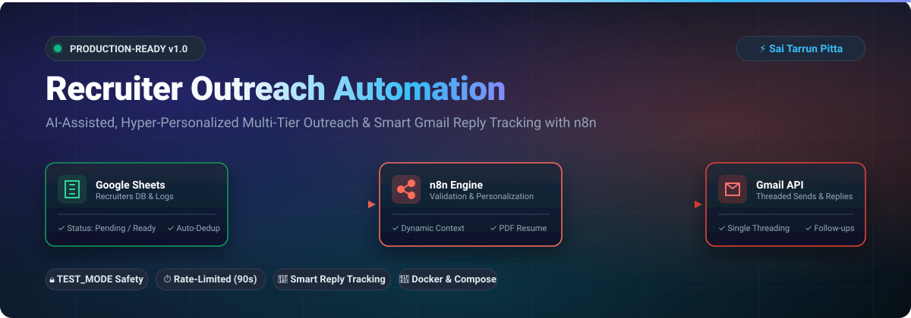

<div align="center">



<br/>
<br/>

[](https://n8n.io)
[](https://developers.google.com/gmail/api)
[](https://developers.google.com/sheets/api)
[](https://www.docker.com)
[](https://opensource.org/licenses/MIT)

<br/>
<br/>

**A production-ready, intelligent n8n automation suite for high-signal, personalized technical recruiter outreach, dynamic resume attachment, and smart multi-tier Gmail reply tracking.**

[Key Features](#-features) • [System Architecture](#-system-architecture) • [Google Sheets Schema](#-google-sheets-schema) • [Quickstart](#-setup--installation) • [Testing Runbook](#-safety--testing-mode)

</div>

---

## 📌 Features

- **Personalized Email Generation**: Dynamically crafts personalized HTML and plain-text emails based on recruiter name, company focus, and target role—avoiding generic spam-like messaging.
- **Automated Resume Attachment**: Reads and mounts your resume PDF from a local/Docker volume and attaches it directly to outgoing Gmail messages.
- **Idempotency & Duplicate Prevention**: Automatically detects previously contacted recruiters and prevents duplicate initial sends across executions.
- **Gmail Threading**: Follow-up messages (Follow-up 1 & 2) are automatically sent within the **same conversation thread** as the original message for natural communication.
- **Smart Reply Detection**: Inspects Gmail conversation threads before sending any follow-up, automatically halts the sequence when human replies are detected, and intelligently ignores automated out-of-office responses.
- **Configurable Rate Limiting & Safety**: Includes a `TEST_MODE` safety switch, max email limits per execution (`MAX_EMAILS_PER_RUN = 15`), configurable delays (`DELAY_BETWEEN_EMAILS_SECONDS = 90s`), and company-level daily caps (`MAX_RECRUITERS_PER_COMPANY_PER_DAY = 2`).
- **Comprehensive Logging**: Full audit trail recorded to a dedicated Google Sheet tab (`EmailLogs`).

---

## 🏗 System Architecture

```text
                 RECRUITER OUTREACH WORKFLOW
                 
Google Sheets (Recruiters Tab)
     │
     ▼
Validate & Deduplicate ─────── Invalid / Duplicate ───► Skip / Log
     │
     ▼
Rate Limit & Batching (Max 2/company, Max 15/run)
     │
     ▼
Dynamic Personalization (HTML & Plain Text)
     │
     ▼
Attach Resume PDF (/files/Sai_Tarrun_Pitta_Resume.pdf)
     │
     ▼
Gmail Send (Clean formatting, no branding)
     │
     ▼
Update Google Sheet (Status=Sent, FollowUpDate=Now+5d, ThreadID)
     │
     ▼
Log to EmailLogs & Rate Limit Delay (90s)


                 FOLLOW-UP & REPLY DETECTION WORKFLOW

Daily Schedule (Mon-Fri 9:30 AM)
     │
     ▼
Find Due Follow-Ups (FollowUpDate <= Today & Count < 2)
     │
     ▼
Inspect Gmail Thread
     │
     ├── Recruiter Replied ───► Mark Status=Replied ───► STOP
     │
     └── No Reply Found
              │
              ├── Follow-up 1 (Sent + 5-7 days)
              │
              └── Follow-up 2 (Sent + 14 days, Final)
              │
              ▼
         Send in Existing Thread (GmailThreadID)
              │
              ▼
         Update Google Sheet & Log Action
```

---

## 📊 Google Sheets Schema

### Tab 1: `Recruiters`
| Header | Type | Description |
| :--- | :--- | :--- |
| `RecruiterID` | Text | Unique identifier (e.g., `001`) |
| `FirstName` | Text | Recruiter's first name |
| `LastName` | Text | Recruiter's last name |
| `Company` | Text | Target company name |
| `Email` | Text | Recruiter's email address |
| `RecruiterTitle` | Text | Recruiter role title |
| `JobTitle` | Text | Targeted engineering role (optional) |
| `JobLink` | Text | Job application URL (optional) |
| `CompanyFocus` | Text | Custom team/engineering focus for deep personalization |
| `Location` | Text | Office location |
| `Status` | Text | `Pending`, `Ready`, `Sent`, `Follow-up 1`, `Follow-up 2`, `Replied`, `Interview`, `Closed`, `Do Not Contact`, `Failed` |
| `SentDate` | Timestamp | Timestamp of initial outreach |
| `FollowUpDate` | Date | Next scheduled follow-up date (`YYYY-MM-DD`) |
| `FollowUpCount` | Number | Number of follow-ups sent (`0`, `1`, `2`) |
| `LastEmailDate` | Timestamp | Timestamp of latest message |
| `ReplyStatus` | Text | `No Reply`, `Replied`, `Needs Review` |
| `ReplyDate` | Timestamp | Timestamp when recruiter reply was detected |
| `GmailMessageID` | Text | Message ID returned from Gmail API |
| `GmailThreadID` | Text | Thread ID for conversation continuity |
| `Notes` | Text | Additional context or timestamped error logs |

### Tab 2: `EmailLogs`
| Header | Type | Description |
| :--- | :--- | :--- |
| `Timestamp` | Timestamp | ISO timestamp of event |
| `RecruiterID` | Text | Associated recruiter ID |
| `RecruiterName` | Text | Full recruiter name |
| `Company` | Text | Company name |
| `Email` | Text | Recruiter email |
| `Action` | Text | `Initial Email`, `Follow-up 1`, `Follow-up 2`, `Reply Detected`, `Failed` |
| `Status` | Text | `Sent`, `Replied`, `Failed` |
| `GmailMessageID` | Text | Gmail message identifier |
| `GmailThreadID` | Text | Gmail thread identifier |
| `Error` | Text | Error message (if applicable) |

---

## ⚙️ Setup & Installation

### 1. Run n8n with Docker Compose
```bash
docker compose up -d
```

### 2. Mount Resume PDF
Place your resume PDF in `./files/Sai_Tarrun_Pitta_Resume.pdf`:
```bash
cp /path/to/your/resume.pdf ./files/Sai_Tarrun_Pitta_Resume.pdf
```

### 3. Import Workflows
In n8n (`http://localhost:5678`), import the JSON workflows located in the `workflows/` directory:
1. `workflows/1_recruiter_outreach_workflow.json`
2. `workflows/2_recruiter_followup_workflow.json`
3. `workflows/test_email_workflow.json`

### 4. Connect Credentials
1. Add **Google Sheets OAuth2** credential.
2. Add **Gmail OAuth2** credential.
3. Link your Google Sheet document in the workflow nodes.

---

## 🔒 Safety & Testing Mode

By default, `TEST_MODE = true` in the Global Configuration node. All outreach emails are safely redirected to your personal email (`saitarrunpitta@gmail.com`) with the original recipient annotated in the subject line.

To go live:
1. Change `TEST_MODE` to `false` in both workflows.
2. Activate the schedules in n8n.

---

## 👤 Author
**Sai Tarrun Pitta**
- Portfolio: [saitarrunpitta.vercel.app](https://saitarrunpitta.vercel.app)
- LinkedIn: [linkedin.com/in/saitarrunpitta](https://linkedin.com/in/saitarrunpitta)
- GitHub: [github.com/saitarrun](https://github.com/saitarrun)
